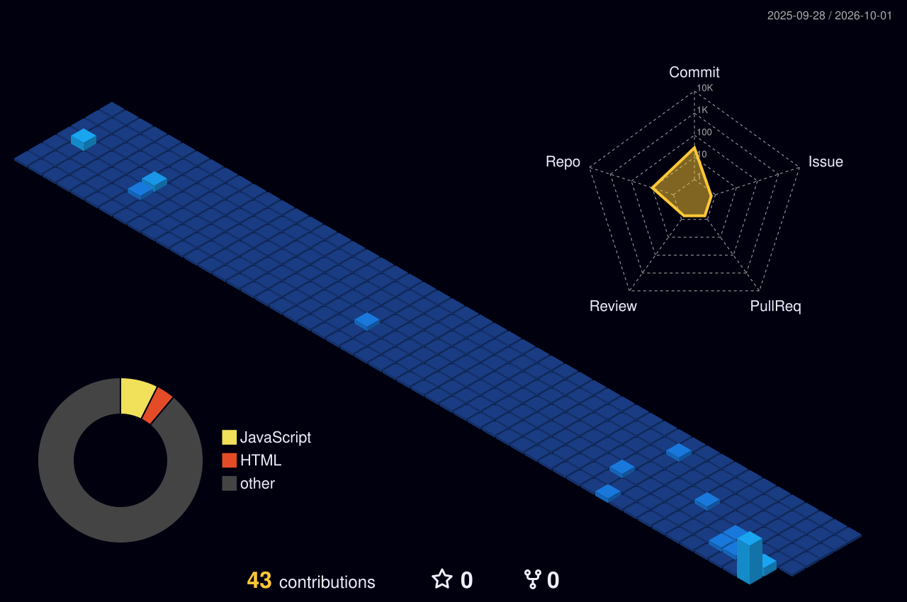

# Hi 👋, I'm Surakshya

### Aspiring Software Developer | Backend & Full-Stack Development

I enjoy building practical software, designing backend systems, working with databases, and turning ideas into useful applications.

---

## 🛠️ Tech Stack

### Languages

  

### Backend & Frameworks

  

### Databases & Tools

  

---

## 💻 What I Work On

* Backend development and REST APIs
* Full-stack web applications
* Database design and SQL
* Authentication and API integration
* Data processing and integration
* Clean and maintainable software

---

## 📊 GitHub

<!-- GITHUB_STATS_START -->

  <b>📦 11 Public Repositories</b>
  &nbsp;&nbsp;•&nbsp;&nbsp;
  <b>⭐ 0 Stars</b>
  &nbsp;&nbsp;•&nbsp;&nbsp;
  <b>👥 2 Followers</b>
  &nbsp;&nbsp;•&nbsp;&nbsp;
  <b>👤 3 Following</b>

  <b>📝 12 Contributions</b>
  &nbsp;&nbsp;•&nbsp;&nbsp;
  <b>🔀 0 Pull Requests</b>
  &nbsp;&nbsp;•&nbsp;&nbsp;
  <b>🐛 0 Issues</b>
  &nbsp;&nbsp;•&nbsp;&nbsp;
  <b>🍴 0 Forks</b>

  Automatically updated from GitHub

<!-- GITHUB_STATS_END -->

---

## 📈 GitHub Activity

  

---

## 🧊 3D Profile

  

---

## 🚀 Explore My Work

  

  Projects · Experience · CV · Skills · Contact

---

## 🌐 Connect

  
  
  

---

  <i>Building · Learning · Improving 🚀</i>

